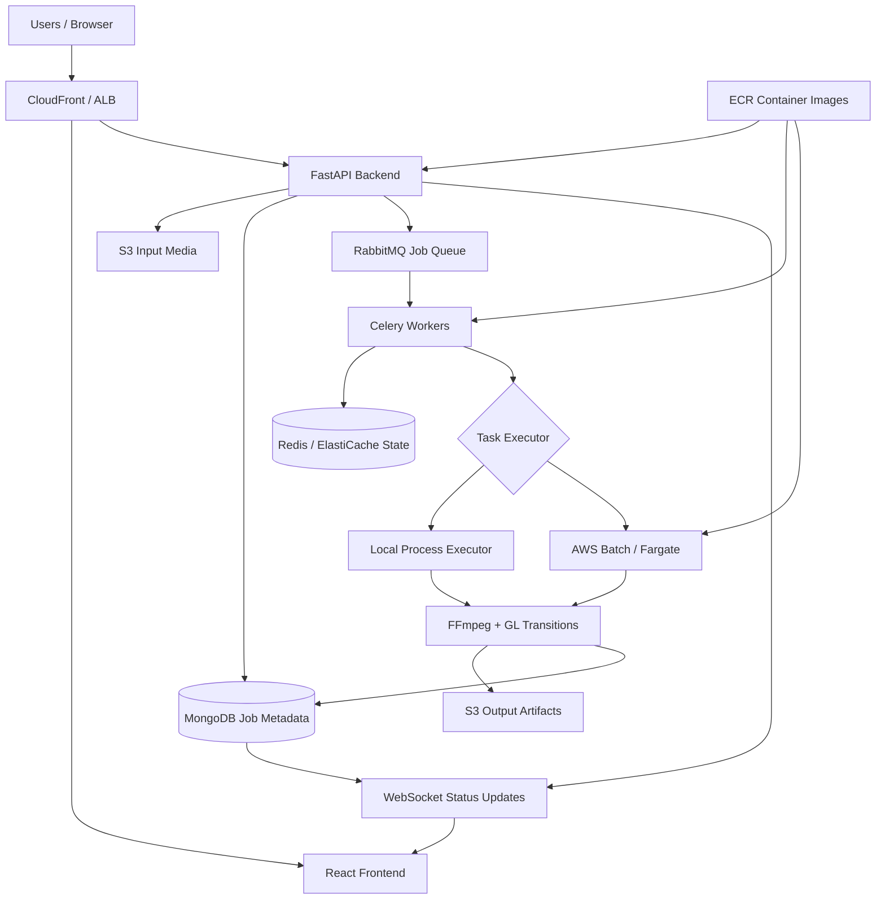
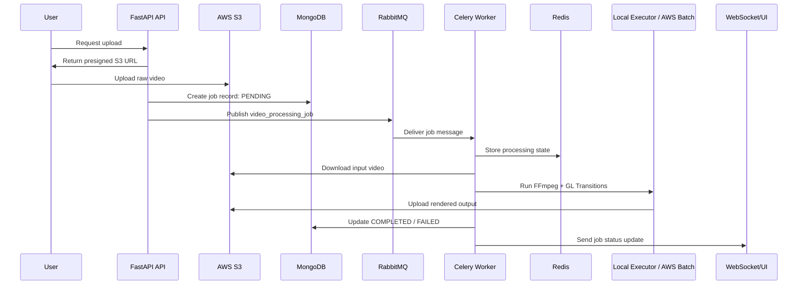
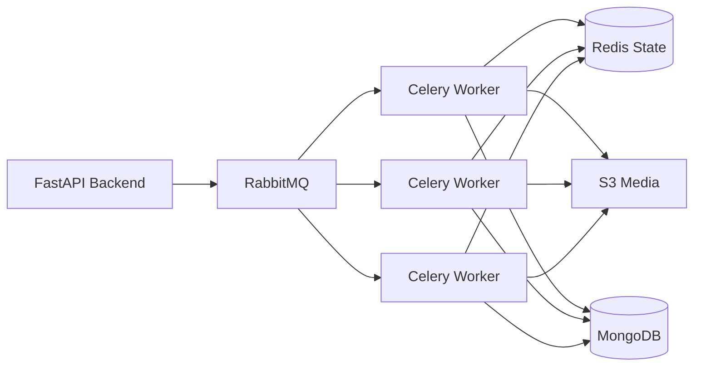
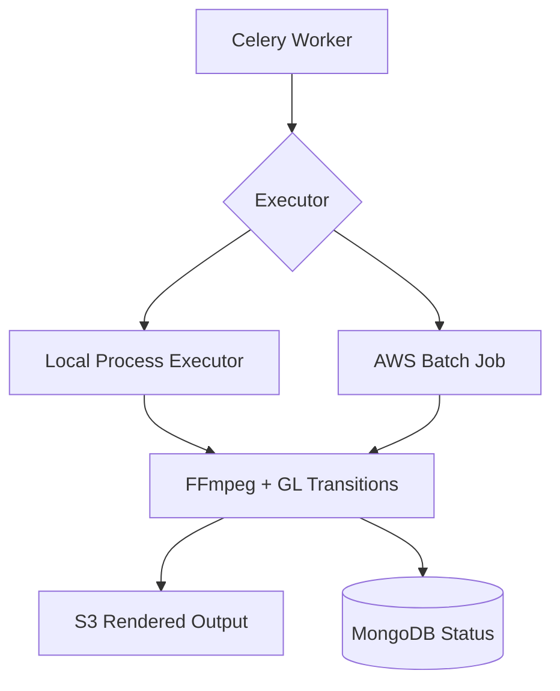
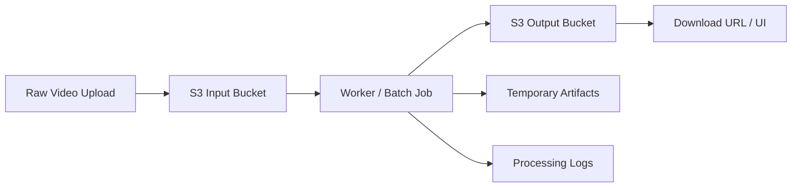
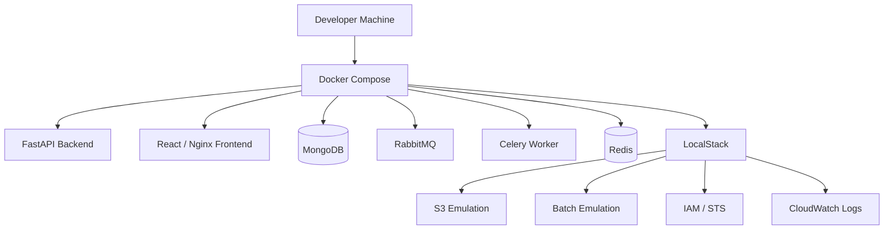
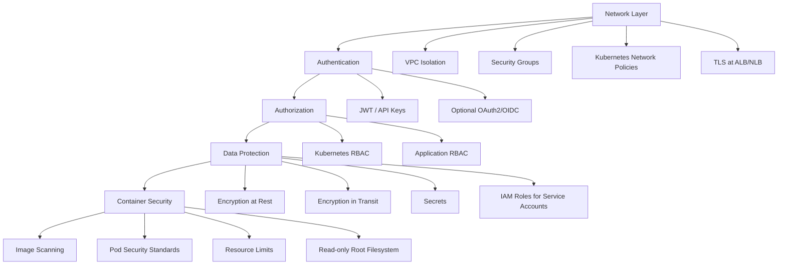
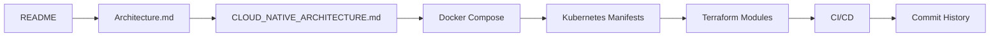

# VIDX Infrastructure Architecture

> Cloud-native video rendering infrastructure for async media processing.

## 1. Background

I built `vidx-infra` around a simple production problem:

> Video rendering is too heavy, slow, and bursty to run inside the API request cycle.

A user-facing API should stay responsive while rendering work runs separately. The infrastructure separates:

- request handling
- file storage
- job metadata
- queue-based dispatch
- worker execution
- long-running batch compute
- status updates
- deployment and scaling

Core idea:

> The API is the control plane.  
> Workers and batch jobs are the execution plane.  
> Object storage is the source of truth for large media artifacts.

---

## 2. System Overview

At a high level, the system accepts a video job through the API, stores media in S3, records job state in MongoDB, dispatches work through RabbitMQ, processes video through workers or AWS Batch, writes outputs back to S3, and notifies the UI through real-time status updates.

---

## 3. Video Processing Flow

The important design choice is that the API does not directly render video. It validates requests, creates jobs, and dispatches work. Rendering happens asynchronously in workers or batch compute.

---

## 4. Main Components

| Component | Role |
|---|---|
| React Frontend | User interface, upload flow, job status, result download |
| CloudFront / ALB | CDN, routing, load balancing, TLS entry point |
| FastAPI Backend | REST API, auth, validation, job creation, WebSocket updates |
| MongoDB | Job metadata, status, file locations, processing results |
| RabbitMQ | Durable job dispatch between API and workers |
| Celery Workers | Async task execution and orchestration of video jobs |
| Redis / ElastiCache | Task state, cache, sessions, worker coordination |
| AWS Batch / Fargate | Long-running video processing compute |
| FFmpeg + GL Transitions | Media rendering, transitions, encoding, frame processing |
| S3 | Raw uploads, rendered outputs, temporary artifacts, backups |
| ECR | Container images for API, workers, frontend, and batch jobs |
| Terraform | Repeatable AWS infrastructure provisioning |
| Kubernetes / EKS | Container orchestration, scaling, service deployment |

---

## 5. API as Control Plane

The FastAPI backend acts as the control plane for the system.

It is responsible for:

- validating upload and render requests
- checking authentication and authorization
- creating job records
- generating presigned S3 upload URLs
- publishing jobs to RabbitMQ
- exposing job status APIs
- sending WebSocket updates to the UI

The API should remain lightweight. It coordinates work, but it does not perform the expensive rendering itself.

Why it matters:

- API latency stays predictable
- large uploads do not turn the API into a file proxy
- worker failures do not directly crash request handling
- API pods and worker pods can scale independently

---

## 6. Queue and Worker Execution

RabbitMQ and Celery create a clear boundary between request handling and background work.

The queue provides:

- async job dispatch
- worker concurrency
- retry behavior
- backpressure during bursts
- isolation between API traffic and rendering load

For this workload, the goal is task execution rather than event streaming. A job enters the queue, a worker claims it, processes it, and writes the result.

---

## 7. Batch Processing Layer

Some video jobs can run inside worker containers. Heavier jobs should run in separate batch compute.

AWS Batch is used for long-running or heavier rendering jobs so they do not starve the Kubernetes service layer.

This makes the architecture more flexible:

- simple jobs can run locally through workers
- heavy jobs can run through managed batch compute
- compute can scale separately from API pods
- future GPU or EC2-based workloads can be isolated from the main service tier

---

## 8. Storage and Artifacts

Large media files are not stored inside the API process or worker memory longer than necessary.

S3 is used for:

- raw input videos
- rendered output files
- temporary artifacts
- backup storage
- durable handoff between API, workers, and batch jobs

This keeps large binary objects out of the database and out of the request cycle.

---

## 9. Local Development

The local environment mirrors the production shape without requiring real AWS resources for every development task.

Local Docker and LocalStack make it possible to test the full workflow shape locally:

- API request handling
- frontend routing
- job creation
- queue dispatch
- worker processing
- Redis state
- S3-like storage
- AWS-like service integration

---

## 10. Scaling and Reliability

The system is designed around independent scaling paths.

| Layer | Scaling Strategy |
|---|---|
| Frontend | CloudFront caching and static hosting |
| API | Multiple FastAPI pods behind ALB, HPA based on CPU/memory |
| Workers | Scale worker replicas based on processing load or queue depth |
| Batch | Separate compute environment for long-running jobs |
| Storage | S3 for durable media and artifacts |
| Metadata | MongoDB for job state and queryable metadata |
| State | Redis / ElastiCache for fast task state and coordination |

Reliability concerns:

- job state is persisted outside worker memory
- media artifacts are stored in S3
- failed jobs can update status instead of disappearing
- queue-backed processing provides backpressure
- workers can be restarted without losing the whole system state
- API and processing workloads are isolated from each other

---

## 11. Security Model

Security is layered across infrastructure, application, and runtime boundaries.

The goal is not one security control, but multiple boundaries:

- network isolation
- authenticated API access
- scoped authorization
- encrypted data paths
- managed secrets
- least-privilege cloud access
- container runtime hardening

---

## 12. Key Design Decisions

| Decision | Why |
|---|---|
| Separate API from video processing | Keeps request handling responsive and isolates heavy jobs |
| Use presigned S3 uploads | Avoids routing large file uploads through API pods |
| Use RabbitMQ + Celery | Fits durable background task execution with retries and workers |
| Use MongoDB for job metadata | Stores flexible job records, file locations, status, and results |
| Use Redis for task state | Fast shared state for workers and job progress |
| Use AWS Batch for heavy jobs | Moves long-running compute outside the Kubernetes service layer |
| Use S3 for media artifacts | Durable object storage for large files and outputs |
| Use Terraform | Makes AWS infrastructure repeatable, reviewable, and environment-aware |
| Use Docker / LocalStack locally | Lets developers test the architecture shape without real cloud resources |
| Use EKS and HPA | Supports container orchestration and independent service scaling |

---

## 13. Repo Walkthrough

Recommended interview path:

What to show:

1. Start with the architecture problem: video rendering is heavy and should be async.
2. Show the high-level system diagram.
3. Walk through the upload-to-render flow.
4. Explain why API, queue, workers, S3, and Batch are separated.
5. Show Terraform/Kubernetes pieces as deployment proof.
6. End with commit history and explain how the project moved from local services to cloud-native hardening.

---

## 14. Interview Summary

VIDX Infra shows the platform side of the project:

- cloud-native deployment
- async background processing
- task queues and workers
- object storage for media artifacts
- long-running batch compute
- Kubernetes scaling
- Terraform-managed infrastructure
- local development parity
- production security boundaries

The main architecture principle is simple:

> Keep the API responsive, keep media durable, process jobs asynchronously, and scale the rendering layer separately from the user-facing service layer.
